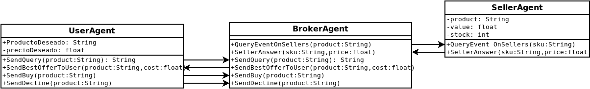

# Ejemplo de Sistema Multiagente - Broker

## Participates
- Un _user_ que realiza consultas
- Un _broker_ que consulta con los _sellers_ las ofertas
- Diferentes _sellers_ que responden a la demanda de producto ofrecida por el broker.

## Código
Compilado con la versión 0.8.6 de [SARL](www.sarl.io)

